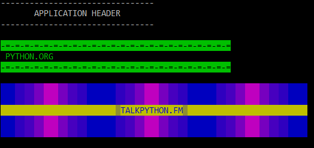

## What?

A TalkPython.fm Python Jumpstart inspired Application Header helper

## Why?
- It's fun and it's [DRY](https://en.wikipedia.org/wiki/Don%27t_repeat_yourself) :)

## How?

Requirements: 

- If you are on Windows, you will need to `pip install colorama`

```python
>>> import header
>>> print(header.header())

--------------------------------
       APPLICATION HEADER       
--------------------------------
```

or for a proper demo:
```python
$ python header.py
```


